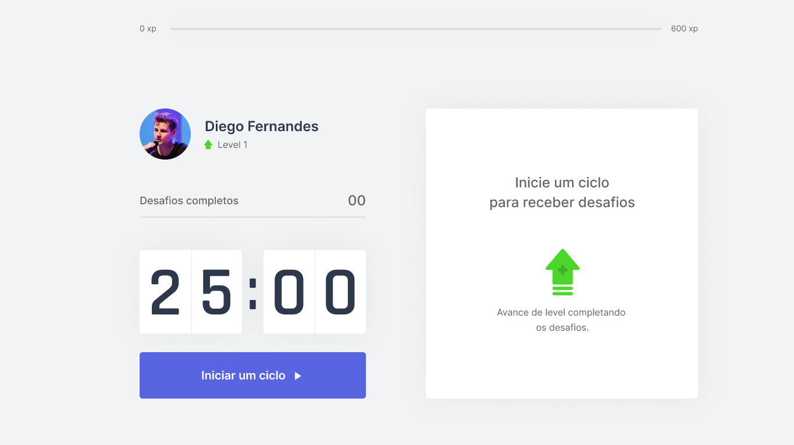

### ✨ Conheça o Moveit 🚀 feito durando a NLW v.4 🚀

   

### ☄️ Descrição ☄️

   O Moveit é um Software que te ajuda durante sua jornada com o computador,  
   Com ele você Estuda/Trabalha de forma eficiente, ultilizando a motodogia de pomodoro,  
   Você mantém um foco no aprendizado durante um determinado tempo e após isso recebe desafios,  
   Seus desafios conclídos geram XP que te levam para o próximo Level 🚀  

### 🌌 Tecnologias 🌌

- Typescript
- React
- Next.js

Feito por [Gustavo Mendes](https://github.com/Gustavo-Developer) Durante a NLW v.4 🚀.  
Esse Repósitorio contém uma [MIT Licence]
